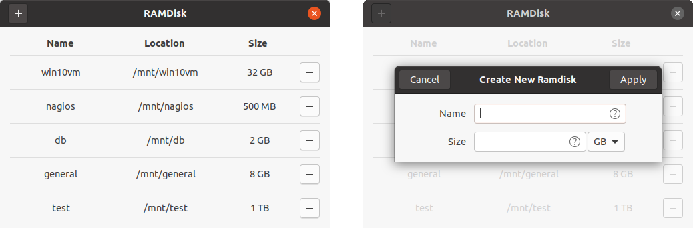

## Software to create a ramdisk on Linux (GUI)



### What is RAMDisk

RAMDisk is a free and open-source Linux software that makes it easy to create a ramdrive (to use part of your RAM as a drive). In short, it takes care of creating a folder that will be used as a mount point and mounting it at startup as a tmpfs filesystem.

### RAMDisk uses

Speeding up IO heavy operations is the most utilized feature of ramdrives. You can use it to build software, store virtual disk images or cache directories, host monitoring software, perform database queries, etc.

If you’re worried about your SSD’s (or HDD’s) lifespan, you can download temporary files to ramdrive.

You can even use it for gaming if you have a lot of RAM.

### How to install

Open Terminal and type

```
git clone https://github.com/estarq/ramdisk
cd ramdisk
sudo python3 install.py
```

Note that you need to have Git installed to download RAMDisk.
You can [download Git here](https://git-scm.com/download/linux).

### How to remove

Navigate to the previously downloaded `ramdisk` folder and type

```
sudo python3 remove.py
```

### Supported distributions

antiX, ArcoLinux, Elementary, EndeavourOS, Gecko, Kali, KDE neon, Kubuntu, Linuxfx, Lite, Lubuntu, LXLE, Mageia, Manjaro, Mint, MX Linux, OpenMandriva, openSUSE, Parrot, Peppermint, Pop!_OS, Q4OS, Raspberry Pi OS (Raspbian), Solus, SparkyLinux, Tails, Trisquel, Ubuntu, Ubuntu Budgie, Ubuntu Kylin, Ubuntu MATE, Ubuntu Studio, Xubuntu, Zorin

antiX users must use Terminal to run RAMDisk.

### What’s next for RAMDisk

By the end of Q3 2021, I’d like to change the way RAMDisk is distributed (official repos would be nice) and add support for remaining popular distributions like CentOS, Debian, Devuan, Fedora, KaOS, PCLinuxOS, or PureOS.

[](https://hits.seeyoufarm.com)
